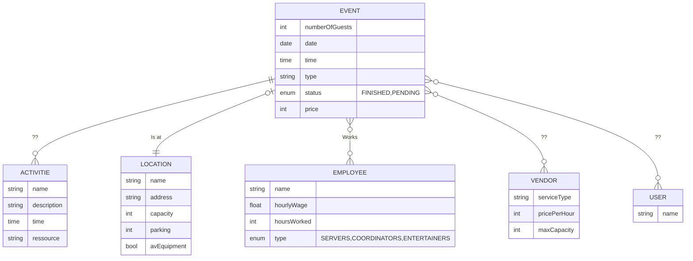

# Generated Scenario

Application Description: Event Planning System

You are designing a small event planning application for a company that organizes private events such as weddings, corporate meetings, and birthday parties. The company wants to streamline its process of managing clients, venues, staff, and vendors. Below is the description of the system, along with interviews from stakeholders to provide context for the functionality.
General Functionality

The application should allow clients to book events, specify details such as the venue, and hire specific services (e.g., catering, decoration, photography). Each event has a schedule, which might include different activities (e.g., speeches, performances, or meals) planned at specific times.

Venues are central to the business, and each venue comes with a set of features, such as capacity and facilities (e.g., parking, AV equipment). The company also employs a pool of staff members who can be assigned to different events in various roles, such as servers, coordinators, or entertainers.

Vendors provide services or products (e.g., catering, floral arrangements, music bands), and the company works with multiple vendors depending on the client’s requirements. Each vendor provides specific services, and the system should track agreements and rates.
Stakeholder Interviews

1. Interview with the Operations Manager:

   "We need to ensure that every event is smoothly organized. Each event should be tied to a venue, and venues have different capacities. We don’t want a client to book a venue that can’t accommodate their guest count. Staff assignments are crucial as well—we need to know who’s working on what event to avoid overlaps."

2. Interview with a Sales Representative:

   "Our main focus is on clients. Each client can book one or more events, but we need to keep their details, like contact information, preferences, and payment history, handy. Sometimes a single event might require services from multiple vendors, and we negotiate contracts with these vendors for specific events."

3. Interview with the Scheduling Coordinator:

   "The schedule of activities within an event is key. Clients often provide a list of what they want to happen and when—this might include the time for a welcome speech, dinner service, or entertainment. Each activity might need specific resources, like a microphone or a projector."

4. Interview with a Vendor Manager:

   "We work with a variety of vendors. Some specialize in catering, others in decor or photography. It’s important that we track the specific services each vendor offers and their rates, as well as which vendors were involved in past events."

5. Interview with a Client:

   "When I book an event, I want to choose a venue based on the number of guests. I also want to customize everything—pick services like catering and entertainment and specify a detailed schedule of what happens and when."

Additional Notes

    The system should generate invoices for clients based on the services and venue they book. Each invoice should include a breakdown of costs for the venue, staff, and vendor services.
    Staff availability needs to be monitored, as the same person cannot be assigned to multiple events at the same time.
    Clients often request a summary of their events, including details about the venue, staff, vendors, and schedule.

With this description and the stakeholder insights, you should have enough information to extract the entities and relationships for your database model. Good luck!

# Own ERD-Diagram

